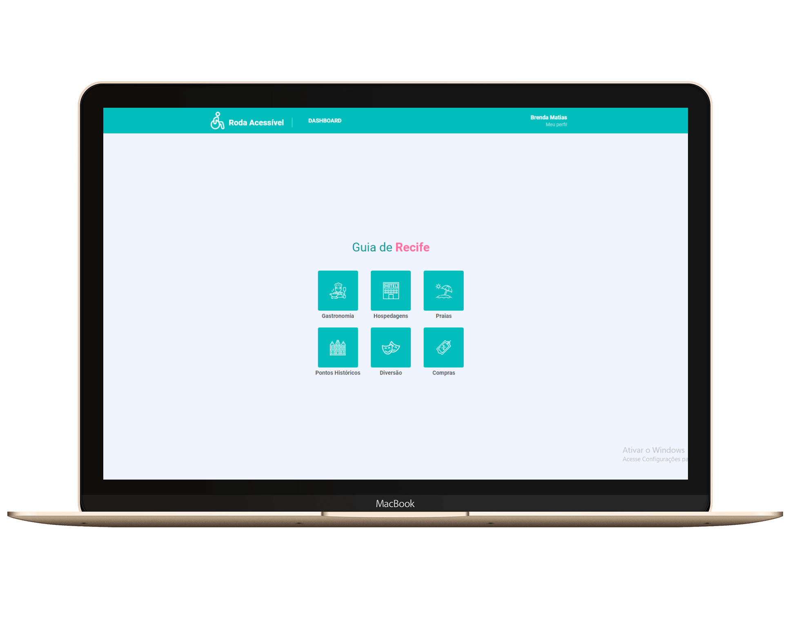

<h1 align="center">
    Roda Acessível :wheelchair:
</h1>

<h4 align="center">
  ☕ Code and coffee
</h4>

  <a href="#rocket-tecnologias">Tecnologias</a>&nbsp;&nbsp;&nbsp;|&nbsp;&nbsp;&nbsp;
  <a href="#-projeto">Projeto</a>&nbsp;&nbsp;&nbsp;|&nbsp;&nbsp;&nbsp;
  <a href="#-iniciando-aplicação">Iniciando aplicação</a>&nbsp;&nbsp;&nbsp;|&nbsp;&nbsp;&nbsp;
  <a href="#-mobile">Mobile</a>

 

  

## :rocket: Tecnologias

Esse projeto foi desenvolvido com as seguintes tecnologias:

- [React](https://reactjs.org)

## 💻 Projeto

O Roda Acessível é uma aplicação que visa disponibilizar informações sobre locais acessíveis na cidade do Recife a deficientes físicos, em especial, aos cadeirantes.

## :zap: Iniciando aplicação

- Configure o backend em: <a href="https://github.com/brendamatias/roda-acessivel-server">Backend</a>
- Clone este repositório usando `git clone git@github.com:brendamatias/roda-acessivel-web.git`;
- Mova-se para diretório da aplicação: `cd roda-acessivel-web`;
- Execute `yarn install` ou `npm install` para instalar as dependências;
- Inicie a aplicação com `yarn start` ou `npm start`;

## :iphone: Mobile

- Aplicação mobile disponível em: <a href="https://github.com/brendamatias/roda-acessivel-app">Mobile</a>

---

### <a href="https://www.linkedin.com/in/brenda-matias/">LinkedIn</a>
